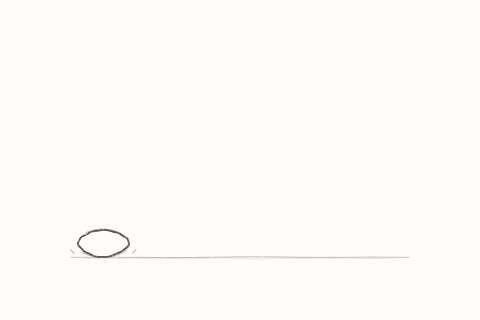

# Jago Loop Studio

**Animated drawing & illustration by Cameron Jago Lis Illustrates.**

A small, offline drawing studio for lively lines, textured brushes and short animated loops. Draw smoothly or on a crisp pixel grid, add movement to strokes or layers, and export a GIF, PNG, sprite sheet or full-motion PNG sequence.

Original inspiration: **John Earnest (Internet Janitor), creator of WigglyPaint and Decker**. This is an independent implementation, with its own renderer and Windows shell. It is not an official release or endorsement by the original creator.

## Open v1.0.6

Extract the release ZIP first, then double-click **Jago-Loop-Studio.exe** on Windows or **Jago-Loop-Studio.html** in a modern browser. Each application file is self-contained. The Windows edition requires 64-bit Windows and Microsoft WebView2 Runtime.

For a hosted version, serve **index.html**. No server application, account or installation is needed for the browser edition.

## What you can do

- Choose Classic line boil, Sway, Ripple, Flutter, Breathe, Spring, Drift or Texture crawl, with controls for each type.
- Move individual strokes or an entire layer. Preview, coordinate timing, pin ends and fit motion to a loop.
- Draw with eleven starter stamp tips, import your own PNG marks, or turn a selection into a brush.
- Shade with alpha lock, clipping layers, blend modes, hatching and pixel dithering.
- Select, copy, cut, move, scale and rotate part of a drawing with corner and rotation handles while keeping its animation.
- Reset brush/stamp settings, preview the actual brush proportions, and choose Charcoal, Warm paper, Midnight plum or Candy cloud.
- Animate with frames, holds, adjustable before/after onion skin, loop or ping-pong playback, and frame artwork copying.
- See layer thumbnails and duplicate a layer across every frame.
- Draw with left/right, top/bottom, four-way or radial symmetry and a movable centre.
- Switch between smooth and pixel rendering without replacing the original strokes.
- Save stamp and motion presets, use canvas guides, and keep local recovery snapshots.

**Updating an earlier Windows copy:** save your drawing as a .jago project and export any custom preset library before switching. This build uses a fresh Jago Loop Studio profile; open your project and import your library to continue.

**Save** creates an editable **.jago** project. Older Studio **.wiggly** projects still open. New projects do not open in the old app. Original Decker projects use a different format.

## Included

| Folder or file | What it contains |
| --- | --- |
| Examples | Editable bouncing balls, motion/shading studies, brush and shape samplers, starter presets |
| Documentation/User-guide.md | Tools, motion settings, shading and shortcuts |
| Documentation/Brush-packs.md | Make, save and share your own stamp packs |
| Documentation/Credits.md | Inspiration, creator credit and component licences |
| Source | Browser and Windows source with rebuild instructions |

## Licence

Jago Loop Studio's contributions and documentation use the [MIT License](LICENSE), copyright (c) 2026 **Cameron Jago Lis Illustrates**. The Windows app includes Microsoft WebView2 components; their licence and third-party notices are in [Notices](Notices). Keep the Studio licence and the applicable Microsoft notices with redistributed copies. WigglyPaint and Decker are credited as inspiration, not bundled dependencies.

The browser app does not send drawings to a service. Autosaves and presets live on your device; downloaded project files are your portable backup. Read the [user guide](Documentation/User-guide.md) for limits and storage behaviour.

## Release information

Version 1.0.6 includes the complete drawing and animation toolset above. See [release notes](Documentation/Release-notes.md) for its development history and packaging cleanup.

## About & support

Jago Loop Studio is an independent project by **Cameron Jago Lis Illustrates**.

- [Visit my illustration website](https://cameronjagolis.co.uk/)
- [Support Jago Loop Studio on Ko-fi](https://ko-fi.com/cameronillustrates)
- [Source, releases and issue reports on GitHub](https://github.com/snowwy123/Jago-Loop-Studio)

Support is optional. The app stays free, with all drawing tools available. Contributions support Cameron's work on Jago Loop Studio.

Image import now lives in Layers, with a choice of a new named layer or the active layer.
